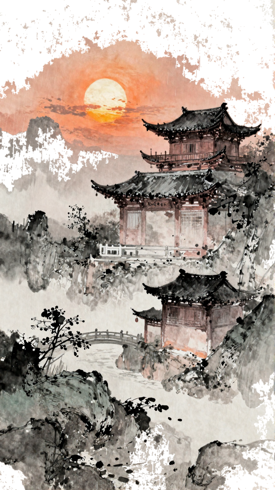

<p align="center">
  
</p>

# Whiteboard Video Generator

[中文](README.md)

A local visual workflow for turning ink-wash paintings, doodles, illustrations, photos, and existing line art into hand-drawn MP4 videos. The application extracts line art and color information, follows the recognized strokes, restores color progressively, writes an optional brush-style title, and finishes with a dimensional seal action.

The Gradio interface is the primary entry point. Recognition and rendering can run locally.

## Latest Ink-Wash Demo

<table>
  <tr>
    <td width="50%">
      <strong>Input</strong><br>
      
    </td>
    <td width="50%">
      <strong>Drawing Process</strong><br>
      <a href="examples/cases/ink-wash-ancient-town/output.mp4">
        
      </a><br>
      <a href="examples/cases/ink-wash-ancient-town/output.mp4">Open the 19-second MP4</a>
      · <a href="examples/cases/ink-wash-ancient-town/lineart.png">View extracted line art</a>
    </td>
  </tr>
</table>

## Workflow

```text
Upload or paste an image
  -> normalize its background to pure white
  -> select a processing mode and extract line/color data
  -> inspect the extraction preview
  -> configure drawing, coloring, title, and seal
  -> render and preview the MP4
```

Video generation remains disabled until line-art extraction has completed.

## Features

- Four processing modes: standard line art, ink-wash, full-color doodle, and existing line art.
- Ink-aware extraction for dark, medium, and light ink, dry-brush texture, solid blocks, and wash boundaries.
- Stroke ordering based on local continuity, with rendering that follows the extracted line art throughout the process.
- Progressive color restoration based on differences between the source image and extracted line art.
- Automatic coloring-duration suggestions based on source color complexity.
- Pigsy, Monkey King, Tang Monk, Guan Yu, and Zhuge Liang animated drawing tools.
- Brush, quill, rooster-feather quill, realistic eraser, and branded tools.
- Multiline brush-style titles with Mao-style and cursive fonts, live preview, sizing, and positioning.
- Custom seal text, style, position, and a vertical dimensional stamping action.
- Original-size, landscape, and portrait output at 15–60 FPS.
- Stable video preview, status display, and stage-colored rendering progress.

## Installation

Requirements:

- Python 3.11+
- FFmpeg with `libx264`
- A PyTorch-capable local environment for neural line-art providers

```bash
git clone https://github.com/linjie2008/whiteboard-video-engine.git
cd whiteboard-video-engine

python3 -m venv .venv
source .venv/bin/activate
pip install -e ".[dev,lineart]"
```

## Start the App

```bash
python app.py
```

Open `http://127.0.0.1:7860`.

## Line-Art Providers

- Anime2Sketch for anime, portraits, and white-background illustrations.
- Informative Drawings for photos and object contours.
- A dedicated local ink-wash pipeline for ink levels, dry-brush texture, and solid blocks.
- A full-color doodle pipeline for palette and color-region extraction.

Third-party model repositories and weights are intentionally excluded from Git. See [docs/MODELS.md](docs/MODELS.md) for local setup.

## CLI

The UI is recommended, while the CLI remains available for batch rendering:

```bash
whiteboard doctor
whiteboard extract-lineart input.png -o lineart.png --provider ink-wash
whiteboard render-photo input.png -o output.mp4 --lineart-provider ink-wash
whiteboard render-image lineart.png -o output.mp4 --source-image input.png
```

## Repository Layout

```text
app.py                         Gradio UI and task state
src/whiteboard_skill/          stroke, color, and video rendering core
tools/lineart/                 ink-wash, doodle, and model adapters
assets/cursors/                animated characters and drawing tools
assets/stamps/                 physical seal and imprint assets
assets/fonts/                  title fonts
examples/cases/                public image, line-art, GIF, and MP4 demos
tests/                         UI-state and rendering regression tests
```

## Tests

```bash
python -m pytest -q
```

## Acknowledgements

This project continues development from the open-source
[whiteboard-video-engine](https://github.com/gnipbao/whiteboard-video-engine) by
[@gnipbao](https://github.com/gnipbao), with substantial additions around the visual workflow, ink-wash and doodle recognition, animated character tools, progressive coloring, title writing, and dimensional stamping.

## License

Project code is licensed under the MIT License. Third-party models, fonts, and assets retain their respective licenses.
