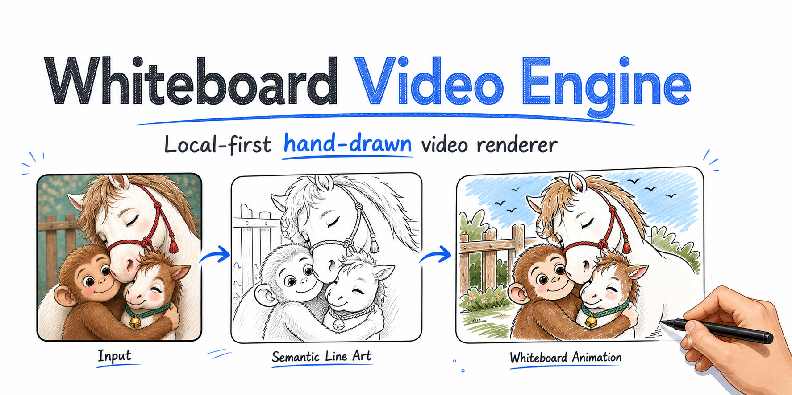
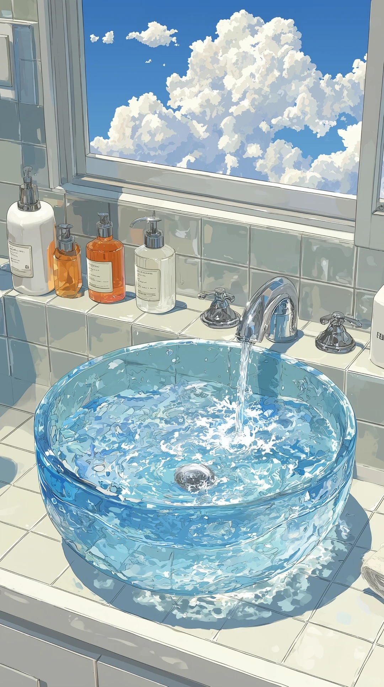
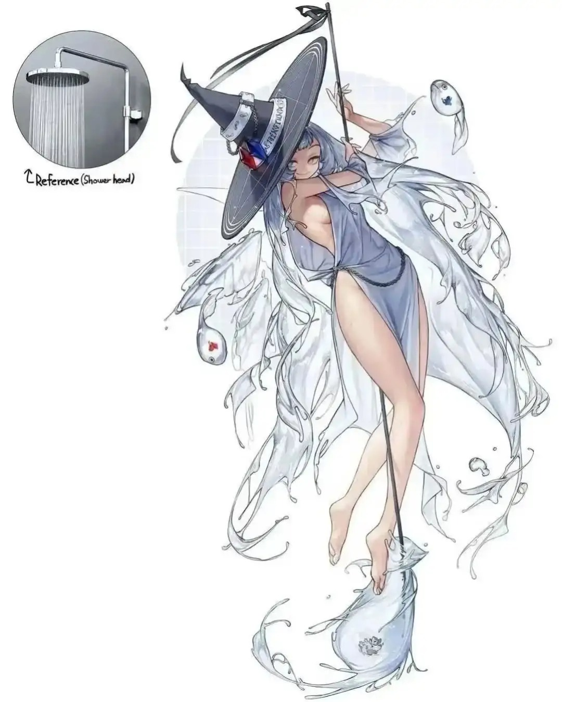
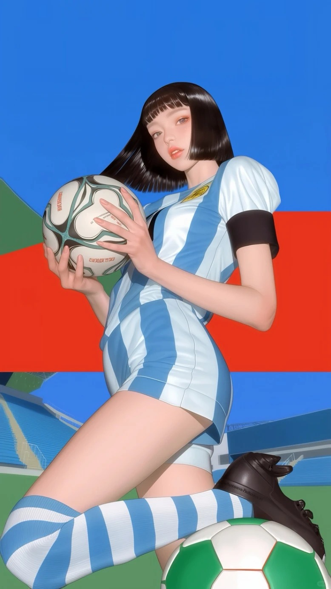

<p align="center">
  
</p>

# 白板手绘视频引擎

[English](README.en.md)

一个本地优先的白板手绘视频引擎，可将 SVG、线稿图、插画和照片转换为逐笔绘制的 MP4 视频。

本仓库专注于底层渲染能力：语义线稿输入、笔画追踪、路径排序、手势跟随和轮廓感上色。Codex Skill 独立维护在 [gnipbao/codex-whiteboard-video-skill](https://github.com/gnipbao/codex-whiteboard-video-skill)。

## 核心能力

- 支持 SVG 和栅格线稿逐笔绘制。
- 支持本地神经网络线稿提取，适配照片、插画和动漫图。
- 支持骨架追踪、路径平滑和短线合并。
- 内置固定角度手势：`asian`、`black`、`children`、`white`。
- 支持 `--draw-text` 将短标题转换为手写路径。
- 支持基于原图的轮廓感上色。
- CLI 优先，方便脚本化、自动化和 Codex 集成。

## 效果演示

<table>
  <tr>
    <td width="50%">
      <strong>输入图</strong><br>
      
    </td>
    <td width="50%">
      <strong>输出预览</strong><br>
      <a href="examples/cases/sports-illustration-anime2sketch/output.mp4">
        
      </a><br>
      <a href="examples/cases/sports-illustration-anime2sketch/output.mp4">查看 MP4</a>
    </td>
  </tr>
</table>

后续案例可继续放入 `examples/cases/<case-name>/`。

### 照片与自然场景案例

`examples/cases/nature/` 展示了复杂照片、自然场景、人物照片和体育梗图在 Informative Drawings provider 下的手绘白板效果。

<table>
  <tr>
    <td width="25%">
      <strong>Pool</strong><br>
      <br>
      <a href="examples/cases/nature/pool.mp4">
        
      </a>
    </td>
    <td width="25%">
      <strong>Interior</strong><br>
      <br>
      <a href="examples/cases/nature/cool.mp4">
        
      </a>
    </td>
    <td width="25%">
      <strong>Portrait</strong><br>
      <br>
      <a href="examples/cases/nature/girl.mp4">
        
      </a>
    </td>
    <td width="25%">
      <strong>Sports</strong><br>
      <br>
      <a href="examples/cases/nature/halande.mp4">
        
      </a>
    </td>
  </tr>
</table>

## 安装

```bash
python3 -m pip install "git+https://github.com/gnipbao/whiteboard-video-engine.git"
```

本地开发：

```bash
git clone https://github.com/gnipbao/whiteboard-video-engine.git
cd whiteboard-video-engine
python3 -m venv .venv
. .venv/bin/activate
pip install -e ".[dev]"
```

检查环境：

```bash
whiteboard doctor
```

## 快速开始

渲染照片或插画：

```bash
whiteboard render-photo input.jpg \
  -o out/whiteboard.mp4 \
  --duration 15 \
  --fps 30 \
  --lineart-provider auto \
  --stroke-detail rich \
  --hand asian \
  --color-fill contour-wipe
```

渲染已有 SVG 或线稿图：

```bash
whiteboard render-image lineart.png \
  -o out/whiteboard.mp4 \
  --source-image input.jpg \
  --source-fit exact \
  --duration 15 \
  --fps 30
```

复现内置案例：

```bash
whiteboard render-photo examples/cases/sports-illustration-anime2sketch/input.jpg \
  -o out/sports-illustration-anime2sketch.mp4 \
  --duration 15 \
  --fps 30 \
  --lineart-provider anime2sketch \
  --stroke-detail rich \
  --hand asian \
  --tail-color 4.5 \
  --color-fill contour-wipe
```

## 命令行

```bash
whiteboard extract-lineart image.jpg -o lineart.png --provider auto
whiteboard render-photo image.jpg -o output.mp4 --duration 15 --lineart-provider auto
whiteboard render-image lineart.png -o output.mp4 --source-image image.jpg --source-fit exact
whiteboard analyze-image lineart.png -o analysis.json --stroke-detail rich
whiteboard list-hands
whiteboard doctor
```

常用参数：

- `--stroke-detail balanced|rich|max`
- `--hand asian|black|children|white|procedural|none`（默认 `asian`）
- `--line-thickness 0|N`（默认 `0`，根据线稿粗细自动适配；正整数为手动覆盖）
- `--draw-text "标题"`
- `--color-fill contour-wipe|brush-scan|top-down-blocks|fade`
- `--lineart-provider auto|informative|anime2sketch`

## 线稿模型

`render-photo` 和 `extract-lineart` 会从当前运行命令的项目目录自动发现本地模型。模型代码、权重和 wrapper 脚本建议放在同一个项目目录的 `tools/` 下。

推荐目录结构：

```text
my-whiteboard-project/
  .venv-lineart/
    bin/
      python
  tools/
    lineart/
      run_informative_drawings.py
      run_anime2sketch.py
    informative-drawings/              # 必须是完整 clone 的上游项目目录
      test.py
      model.py
      data.py
      util/
      checkpoints/
        model/
          anime_style/
            netG_A_latest.pth
          contour_style/
            netG_A_latest.pth        # 可选
          opensketch_style/
            netG_A_latest.pth        # 可选
    Anime2Sketch/                      # 必须是完整 clone 的上游项目目录
      model.py
      data.py
      utils.py
      weights/
        netG.pth
        improved.bin                 # 可选，有则优先使用
```

注意：`tools/informative-drawings/` 和 `tools/Anime2Sketch/` 不是只放权重的空目录，而是需要完整下载对应上游仓库。wrapper 会 `import` 这些仓库里的 Python 模块；如果只放 `*.pth` / `*.bin`，模型无法运行。

最小可用目录：

- Informative Drawings：需要 `tools/lineart/run_informative_drawings.py` 和 `tools/informative-drawings/checkpoints/model/anime_style/netG_A_latest.pth`。
- Anime2Sketch：需要 `tools/lineart/run_anime2sketch.py` 和 `tools/Anime2Sketch/weights/netG.pth` 或 `tools/Anime2Sketch/weights/improved.bin`。

如果模型放在其他位置，可以显式配置命令：

```bash
export WHITEBOARD_INFORMATIVE_DRAWINGS_CMD="/abs/project/.venv-lineart/bin/python /abs/project/tools/lineart/run_informative_drawings.py {input} {output}"
export WHITEBOARD_ANIME2SKETCH_CMD="/abs/project/.venv-lineart/bin/python /abs/project/tools/lineart/run_anime2sketch.py {input} {output}"
```

支持的线稿模型：

- [Informative Drawings](https://github.com/carolineec/informative-drawings)：适合照片和语义线稿。
- [Anime2Sketch](https://github.com/Mukosame/Anime2Sketch)：适合动漫、漫画和白底插画。

模型路径、环境变量和 wrapper 命令见 [docs/MODELS.md](docs/MODELS.md)。

## 架构

```text
原图 / SVG
  -> 本地线稿模型
  -> 骨架提取 / SVG 路径解析
  -> 笔画排序与路径平滑
  -> 手势跟随渲染
  -> 轮廓感上色
  -> FFmpeg 输出 MP4
```

核心依赖：

- Python、Pillow、NumPy、Pydantic
- FFmpeg
- 可选 PyTorch 线稿模型栈

架构细节见 [docs/ARCHITECTURE.md](docs/ARCHITECTURE.md)。

## Codex Skill

安装引擎后，可继续安装配套 Skill：

```bash
mkdir -p ~/.codex/skills
git clone https://github.com/gnipbao/codex-whiteboard-video-skill.git \
  ~/.codex/skills/whiteboard-video
```

Skill 仓库只包含 Codex 指令和 wrapper 脚本，渲染能力以本仓库为准。

## 案例库

| 案例 | 线稿模型 | 说明 |
| --- | --- | --- |
| `sports-illustration-anime2sketch` | Anime2Sketch | 白底插画、丰富笔画、轮廓感上色 |
| `nature` | Informative Drawings | 照片、自然场景、人物和体育图，展示真实照片到白板手绘视频 |

新增案例建议使用：

```text
examples/cases/<case-name>/
  README.md
  input.jpg
  output-preview.gif
  output.mp4
```

## 仓库边界

不要提交模型仓库、模型权重、虚拟环境、生成过程目录，或没有分发授权的用户上传素材。

少量精选演示素材可放在 `examples/cases/`。

## 许可证

MIT。上游模型代码和权重遵循各自许可证。
